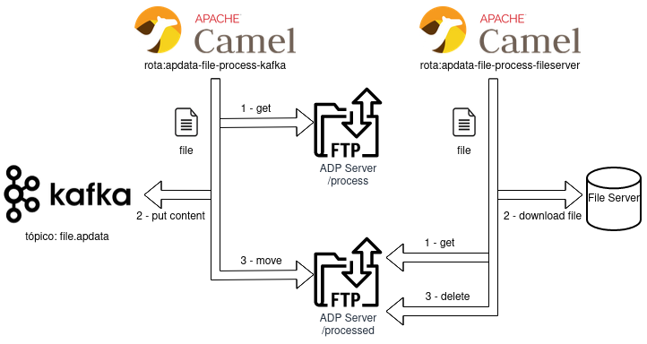

# Camel Usando Kafka, file e FTP com Spring Boot

Esta aplicação implementa duas rotas Camel, de acordo com as regras abaixo:  

1. Buscar arquivos em um servidor FTP, enviar o conteúdo para um tópico no Kafka e mover o arquivo para outra pasta dentro do FTP (pasta processados, por exemplo).   

2. Buscar arquivos na pasta de processados do FTP, fazer o download em um diretório e remover o arquivo do FTP.  

**Visão Geral da Solução**

## Execução local

Versão java utilizada:   
~~~
openjdk 11.0.16 2022-07-19 LTS
OpenJDK Runtime Environment (Red_Hat-11.0.16.0.8-1.el7openjdkportable) (build 11.0.16+8-LTS)
OpenJDK 64-Bit Server VM (Red_Hat-11.0.16.0.8-1.el7openjdkportable) (build 11.0.16+8-LTS, mixed mode)
~~~
   
Versão do maven utilizada:   
~~~
Apache Maven 3.8.6
~~~
   
### Passos

#### Remover, se houver, os certificados e keystore antigos
~~~
rm file-process/ca.crt
rm file-process/truststore.jks
~~~
   
#### Criar uma keystore adicionando o certificado do cluster (substituir o nome da secret e namespace se necessário)
~~~
cd file-process
oc extract -n infra-amqstreams secret/amq-streams-sample-cluster-ca-cert --keys=ca.crt --to=- > ca.crt
keytool -import -trustcacerts -alias root -file ca.crt -keystore truststore.jks -storepass password -noprompt
~~~

#### Criar o tópico abaixo, se não houver. Lembrando de substituir as configurações se necessário.  
~~~
apiVersion: kafka.strimzi.io/v1beta2
kind: KafkaTopic
metadata:
  labels:
    strimzi.io/cluster: amq-streams-sample
  name: file.apdata
  namespace: infra-amqstreams  
spec:
  config:
    min.insync.replicas: '3'
    retention.ms: '604800000'
    segment.bytes: '1073741824'
  partitions: 1
  replicas: 3
  topicName: file.apdata
~~~

#### Rodando um FTP local.   
Será criado um sftp com o usuário foo, senha pass e pasta raiz do usuário apdata.   
~~~
podman run --rm -p 2222:22 atmoz/sftp foo:pass:::apdata
sftp -P 2222 foo@localhost
~~~

#### Criar as pastas para os arquivos a processar e processados no FTP.   
A aplicação está esperando as estruturas:   
~~~
Arquivos a processar: apdata/process
Arquivos processados: apdata/processed
~~~

*observação: basta ajudar os parametros da aplicações caso os nomes e caminhos sejam diferentes.*   

~~~
sftp> cd apdata
sftp> mkdir process
sftp> mkdir processed
~~~

#### Upload de exemplos para o FTP. (ajustar o caminho de acordo com o path local)   

Na pasta *arquivos-exemplo* há uma lista de arquivos para demonstrar a aplicação.
*observação: ajustar o caminho de acordo com a localização do projeto localmente.*    
~~~
sftp> cd apdata
sftp> cd process
sftp> put /home/fguimara/Fernando/projects/repos/bmb/apdata/file-process/arquivos-exemplo/*
~~~

#### Componentes Camel utilizados.

Basicamente os componentes abaixo foram utilizados:

* FTP   
Compoennte para acesso ao servidor FTP   
Documentação: https://camel.apache.org/components/next/ftp-component.html   

* Kafka   
Compoennte para acesso ao Kafka (producer/consumer)   
Documentação: https://camel.apache.org/components/3.20.x/kafka-component.html   

* File   
Compoennte para acesso ao Sistema de Arquivos.      
Documentação: https://camel.apache.org/components/next/ftp-component.html   

#### Parametrizações

## Kakfa properties
kafka.bootstrap-servers=${KAFKA_BOOTSTRAP:amq-streams-sample-kafka-bootstrap-infra-amqstreams.apps.cluster-hz5jk.hz5jk.sandbox2487.opentlc.com:443}
kafka.security.protocol=SASL_SSL
# Producer properties
kafka.producer.properties.sasl.mechanism=SCRAM-SHA-512
kafka.producer.ssl.trust-store-location=${KAFKA_TRUSTSTORE_LOCATION:/home/fguimara/Fernando/projects/repos/bmb/apdata/file-process/truststore.jks}
kafka.producer.ssl.trust-store-password=${KAFKA_TRUSTSTORE_PASSWORD:password}
kafka.producer.ssl.trust-store-type=PKCS12
kafka.producer.properties.sasl.jaas.config=org.apache.kafka.common.security.scram.ScramLoginModule required username="${KAFKA_USER:admin}" password="${KAFKA_USER_PASSWORD:fI6L4IOO5Jqdmd5PYNrU26BUiq2vmpt7}";
topic.name.producer=${KAFKA_TOPIC:file.apdata}

## File Properties
file.directory=${FILE_DIRECTORY:/home/fguimara/Fernando/projects/repos/bmb/apdata/file-process/dir-process}

## FTP Properties
ftp.component=${FTP_COMPONENT:sftp}
ftp.server=${FTP_SERVER:localhost}
ftp.port=${FTP_SERVER_PORT:2222}
ftp.user=${FTP_USER:foo}
ftp.password=${FTP_PASSWORD:pass}
ftp.directory.toprocess=${FTP_DIRECTORY:apdata/process}
ftp.directory.move=${FTP_DIRECTORY_MOVE:../processed}
ftp.directory.processed=${FTP_DIRECTORY_PROCESSED:apdata/processed}
ftp.known_hosts=${FTP_KNOWN_HOSTS_PATH:/home/fguimara/.ssh/known_hosts}
ftp.strictHostKeyChecking=${FTP_STRICT_HOST_KEY_CHECKING:no}
# CronTab
scheduler.cron.expression=${FTP_CRON_EXPRESSION:*/5 * * * * ?}

 - Executando local   
~~~
mvn spring-boot:run
~~~

## Montando a Solução no Openshift
  
Versão testada do Openshift: 4.13
  
1. Crie o projeto abaixo:
~~~
oc new-project apdata-process
~~~

2. Criar o build da aplicação
~~~
oc new-build --binary --strategy=docker --name file-process-app -n apdata-process
~~~

3. Iniciar o build a aplicação
~~~
oc start-build file-process-app --from-dir . -F -n apdata-process
~~~

4. Criar a aplicação - Ajuste se necessário as variáveis de ambiente   
~~~
oc new-app camel-kafka \
-e KAFKA_BOOTSTRAP=amq-streams-sample-kafka-bootstrap.infra-amqstreams.svc.cluster.local:9093 \
-e KAFKA_TRUSTSTORE_LOCATION=/home/jboss/truststore.jks \
-e KAFKA_TRUSTSTORE_PASSWORD=password \
-e KAFKA_USER=admin \
-e KAFKA_USER_PASSWORD=Sx52xxUiOIEQPuHA2KGLRSEkDihdoD4I \
-e KAFKA_TOPIC=file.apdata \
-e FILE_DIRECTORY=/home/jboss \
-e FTP_COMPONENT=sftp \
-e FTP_SERVER=localhost \ 
-e FTP_SERVER_PORT=2222 \
-e FTP_USER=foo \
-e FTP_PASSWORD=pass \
-e FTP_DIRECTORY=apdata/process \
-e FTP_DIRECTORY_MOVE=../processed \
-e FTP_DIRECTORY_PROCESSED=apdata/processed
-e FTP_KNOWN_HOSTS_PATH=/home/fguimara/.ssh/known_hosts \
-e FTP_STRICT_HOST_KEY_CHECKING=no \
-e FTP_CRON_EXPRESSION="*/6 * * * * ?" 
~~~
